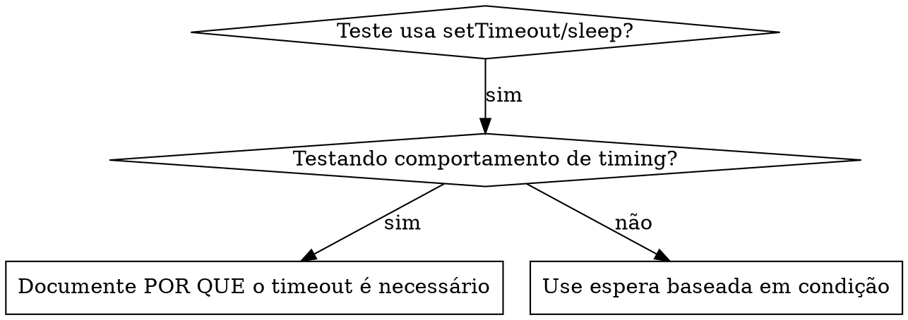

# Espera Baseada em Condição (Condition-Based Waiting)

## Visão Geral

Testes instáveis (flaky tests) frequentemente dependem de timing com delays arbitrários. Isso cria condições de corrida (race conditions) em que os testes passam em máquinas rápidas, mas falham sob carga ou no ambiente de CI.

**Princípio fundamental:** Aguarde a condição real que você deseja verificar, não faça uma suposição de quanto tempo ela levará para ocorrer.

## Quando Usar



**Use quando:**
- Os testes têm delays arbitrários (`setTimeout`, `sleep`, `time.sleep()`)
- Os testes são instáveis (flaky) (passam algumas vezes, falham sob carga)
- Os testes sofrem timeout quando executados em paralelo
- Aguardando a conclusão de operações assíncronas (async)

**Não use quando:**
- Testando comportamento de timing real (ex: intervalos de debounce ou throttle)
- Sempre documente o PORQUÊ caso decida usar um timeout arbitrário

## Padrão Principal

```typescript
// ❌ ANTES: Adivinhando o tempo
await new Promise(r => setTimeout(r, 50));
const result = getResult();
expect(result).toBeDefined();

// ✅ DEPOIS: Aguardando a condição
await waitFor(() => getResult() !== undefined);
const result = getResult();
expect(result).toBeDefined();
```

## Padrões Rápidos

| Cenário | Padrão |
|----------|---------|
| Aguardar evento | `waitFor(() => events.find(e => e.type === 'DONE'))` |
| Aguardar estado | `waitFor(() => machine.state === 'ready')` |
| Aguardar contagem | `waitFor(() => items.length >= 5)` |
| Aguardar arquivo | `waitFor(() => fs.existsSync(path))` |
| Condição complexa | `waitFor(() => obj.ready && obj.value > 10)` |

## Implementação

Função genérica de polling:
```typescript
async function waitFor<T>(
  condition: () => T | undefined | null | false,
  description: string,
  timeoutMs = 5000
): Promise<T> {
  const startTime = Date.now();

  while (true) {
    const result = condition();
    if (result) return result;

    if (Date.now() - startTime > timeoutMs) {
      throw new Error(`Timeout aguardando por ${description} após ${timeoutMs}ms`);
    }

    await new Promise(r => setTimeout(r, 10)); // Polling a cada 10ms
  }
}
```

Consulte `condition-based-waiting-example.ts` neste diretório para ver a implementação completa com helpers específicos de domínio (`waitForEvent`, `waitForEventCount`, `waitForEventMatch`) a partir de uma sessão de debugging real.

## Erros Comuns

**❌ Polling rápido demais:** `setTimeout(check, 1)` - desperdiça CPU
**✅ Solução:** Polling a cada 10ms

**❌ Sem timeout:** Loop infinito se a condição nunca for atendida
**✅ Solução:** Sempre inclua um timeout com erro claro

**❌ Dados desatualizados (stale data):** Cachear o estado antes do loop
**✅ Solução:** Chame o getter dentro do loop para dados atualizados

## Quando Timeout Arbitrário É Correto

```typescript
// A ferramenta emite ticks a cada 100ms - precisamos de 2 ticks para verificar a saída parcial
await waitForEvent(manager, 'TOOL_STARTED'); // Primeiro: aguarde pela condição
await new Promise(r => setTimeout(r, 200));   // Depois: aguarde pelo comportamento temporal
// 200ms = 2 ticks em intervalos de 100ms - documentado e justificado
```

**Requisitos:**
1. Primeiro aguarde a condição de gatilho
2. Baseado em um timing conhecido (sem adivinhar)
3. Comentário explicando o PORQUÊ

## Impacto no Mundo Real

De sessão de debugging (03/10/2025):
- Corrigidos 15 testes instáveis (flaky) em 3 arquivos
- Taxa de sucesso (pass rate): 60% → 100%
- Tempo de execução: 40% mais rápido
- Fim das condições de corrida (race conditions)
