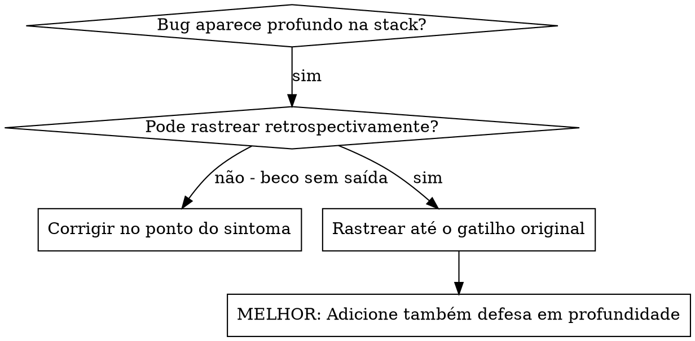
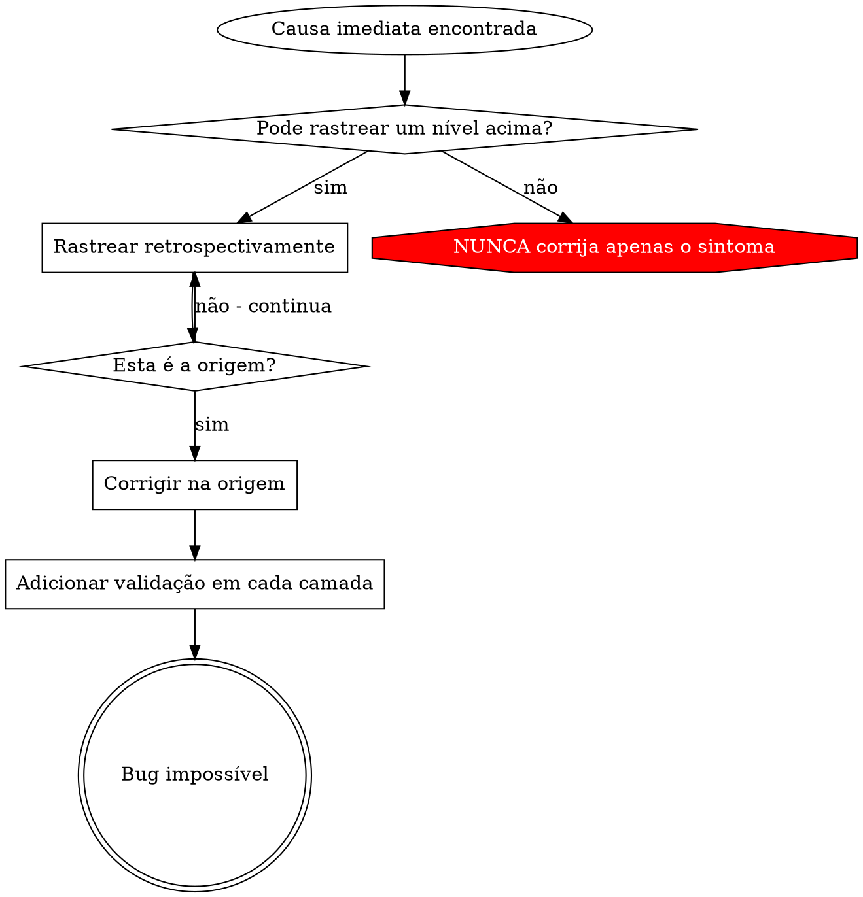

# Rastreamento de Causa Raiz (Root Cause Tracing)

## Visão Geral

Bugs frequentemente se manifestam profundamente na stack de chamadas (como um `git init` no diretório errado, arquivo criado no local errado, banco de dados aberto com o caminho errado). Seu instinto pode ser corrigir no ponto em que o erro aparece, mas isso é tratar apenas o sintoma.

**Princípio fundamental:** Rastreie retrospectivamente pela cadeia de chamadas (call chain) até encontrar o gatilho original e, então, corrija na origem.

## Quando Usar



**Use quando:**
- O erro ocorre profundamente na execução (não no ponto de entrada)
- A stack trace mostra uma longa cadeia de chamadas
- Não está claro de onde os dados inválidos se originaram
- Precisa encontrar qual teste ou código dispara o problema

## O Processo de Rastreamento

### 1. Observe o Sintoma
```
Erro: git init falhou em /Users/jesse/project/packages/core
```

### 2. Encontre a Causa Imediata
**Qual código causa isso diretamente?**
```typescript
await execFileAsync('git', ['init'], { cwd: projectDir });
```

### 3. Pergunte: O Que Chamou Isso?
```typescript
WorktreeManager.createSessionWorktree(projectDir, sessionId)
  → chamado por Session.initializeWorkspace()
  → chamado por Session.create()
  → chamado pelo teste em Project.create()
```

### 4. Continue Rastreando para Cima
**Qual valor foi passado?**
- `projectDir = ''` (string vazia!)
- String vazia como `cwd` é resolvida para `process.cwd()`
- Esse é o diretório do código-fonte!

### 5. Encontre o Gatilho Original
**De onde veio a string vazia?**
```typescript
const context = setupCoreTest(); // Retorna { tempDir: '' }
Project.create('nome', context.tempDir); // Acessado antes do beforeEach!
```

## Adicionando Stack Traces

Quando você não puder rastrear manualmente, adicione instrumentação:

```typescript
// Antes da operação problemática
async function gitInit(directory: string) {
  const stack = new Error().stack;
  console.error('DEBUG git init:', {
    directory,
    cwd: process.cwd(),
    nodeEnv: process.env.NODE_ENV,
    stack,
  });

  await execFileAsync('git', ['init'], { cwd: directory });
}
```

**Crítico:** Use `console.error()` em testes (não logger, pois ele pode ser suprimido)

**Execute e capture:**
```bash
npm test 2>&1 | grep 'DEBUG git init'
```

**Analise as stack traces:**
- Procure por nomes de arquivos de teste
- Encontre o número da linha que dispara a chamada
- Identifique o padrão (mesmo teste? mesmo parâmetro?)

## Encontrando Qual Teste Causa Poluição

Se algo aparece durante os testes mas você não sabe qual teste causou:

Use o script de bisseção `find-polluter.sh` neste diretório:

```bash
./find-polluter.sh '.git' 'src/**/*.test.ts'
```

Ele executa os testes um a um e para no primeiro poluidor. Consulte o script para saber como usá-lo.

## Exemplo Real: projectDir vazio

**Sintoma:** `.git` criado em `packages/core/` (código-fonte)

**Cadeia de rastreamento:**
1. `git init` roda em `process.cwd()` ← parâmetro cwd vazio
2. `WorktreeManager` chamado com `projectDir` vazio
3. `Session.create()` recebe string vazia
4. O teste acessou `context.tempDir` antes do `beforeEach`
5. `setupCoreTest()` retorna `{ tempDir: '' }` inicialmente

**Causa raiz:** Inicialização de variável no nível superior (top-level) acessando um valor vazio

**Correção:** Transformou-se `tempDir` em um getter que lança um erro se for acessado antes do `beforeEach`

**Também adicionou-se defesa em profundidade:**
- Camada 1: `Project.create()` valida o diretório
- Camada 2: `WorkspaceManager` valida que não é vazio
- Camada 3: Verificação de `NODE_ENV` recusa git init fora de tmpdir
- Camada 4: Log do stack trace antes do git init

## Princípio Chave



**NUNCA corrija apenas onde o erro aparece.** Rastreie de volta para encontrar o gatilho original.

## Dicas de Stack Trace

**Em testes:** Use `console.error()` e não logger - o logger pode ser suprimido.
**Antes da operação:** Registre os logs antes da operação perigosa, não depois que ela falhar.
**Inclua contexto:** Diretório, cwd, variáveis de ambiente, timestamps.
**Capture a stack:** `new Error().stack` mostra a cadeia de chamadas completa.

## Impacto no Mundo Real

De sessão de debugging (03/10/2025):
- Encontrada a causa raiz por meio de rastreamento de 5 níveis
- Corrigido na origem (validação no getter)
- Adicionadas 4 camadas de defesa
- 1847 testes passaram, zero poluição
